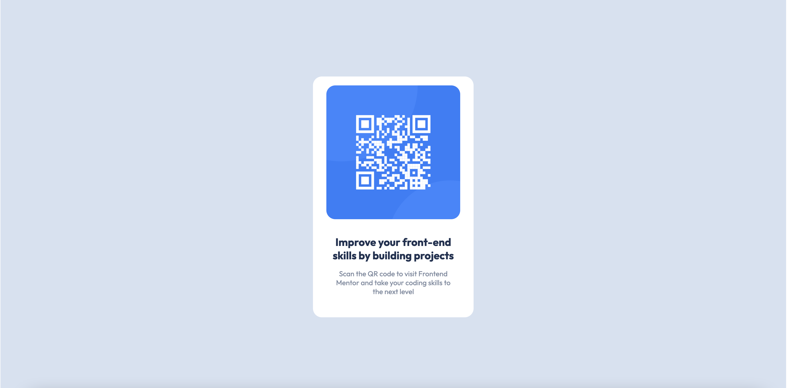

# Frontend Mentor - QR code component solution

This is a solution to the [QR code component challenge on Frontend Mentor](https://www.frontendmentor.io/challenges/qr-code-component-iux_sIO_H). Frontend Mentor challenges help you improve your coding skills by building realistic projects. 

## Table of contents

- [Overview](#overview)
  - [Screenshot](#screenshot)
  - [Links](#links)
- [My process](#my-process)
  - [Built with](#built-with)
  - [What I learned](#what-i-learned)
  - [Continued development](#continued-development)
- [Author](#author)
- [Acknowledgments](#acknowledgments)

**Note: Delete this note and update the table of contents based on what sections you keep.**

## Overview

### Screenshot

### Links

- Solution URL: [https://github.com/i-am-ashwin/frontendmentor-qrcode](https://github.com/i-am-ashwin/frontendmentor-qrcode)
- Live Site URL: [https://i-am-ashwin.github.io/frontendmentor-qrcode/](https://i-am-ashwin.github.io/frontendmentor-qrcode/)

## My process

### Built with

- Semantic HTML5 markup
- CSS custom properties
- Flexbox
- Desktop-first workflow

## Author

- Website - [Aswin Harikumar](https://iamaswin.dev)
- Frontend Mentor - [@i-am-ashwin](https://www.frontendmentor.io/profile/i-am-ashwin)
- Twitter - [@suspicious_usr](https://www.twitter.com/suspicious_usr)

